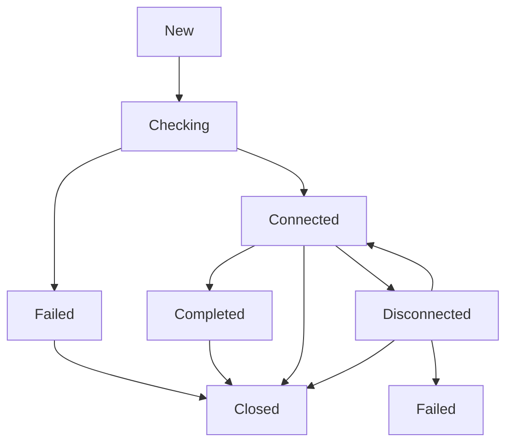

## Overview

The `ConnectionState` enum represents the state of an ICE connection as defined in RFC 5245. The agent transitions through these states as it establishes and maintains a peer-to-peer connection.

## Type Definition

```go
type ConnectionState int
```

## States

### ConnectionStateNew

```go
const ConnectionStateNew ConnectionState = iota + 1
```

The ICE agent is gathering local candidates and has not started connectivity checks.

### ConnectionStateChecking

```go
const ConnectionStateChecking
```

The agent has local and remote candidates and is attempting to find a working pair through connectivity checks.

### ConnectionStateConnected

```go
const ConnectionStateConnected
```

The agent has found a working candidate pair, but may still be checking other pairs for better connectivity.

### ConnectionStateCompleted

```go
const ConnectionStateCompleted
```

The agent has finished all connectivity checks and selected the best candidate pair.

<Note>
In practice, most implementations transition directly from `Connected` to other states without using `Completed`.
</Note>

### ConnectionStateFailed

```go
const ConnectionStateFailed
```

The agent could not establish a connection. All candidate pairs failed connectivity checks or timed out.

### ConnectionStateDisconnected

```go
const ConnectionStateDisconnected
```

The agent was previously connected but has lost connectivity. This is typically triggered after the disconnected timeout expires without receiving packets.

### ConnectionStateClosed

```go
const ConnectionStateClosed
```

The agent has been closed and is no longer processing requests.

### ConnectionStateUnknown

```go
const ConnectionStateUnknown ConnectionState = 0
```

Represents an unknown or uninitialized state.

## Methods

### String

```go
func (c ConnectionState) String() string
```

Returns the string representation of the connection state.

**Returns:**
- `"New"` for ConnectionStateNew
- `"Checking"` for ConnectionStateChecking
- `"Connected"` for ConnectionStateConnected
- `"Completed"` for ConnectionStateCompleted
- `"Failed"` for ConnectionStateFailed
- `"Disconnected"` for ConnectionStateDisconnected
- `"Closed"` for ConnectionStateClosed
- `"Invalid"` for unknown states

## State Transitions



**Common Transitions:**

1. **New → Checking**: When remote credentials are set and connectivity checks begin
2. **Checking → Connected**: When a candidate pair succeeds
3. **Connected → Disconnected**: When no packets received within `DisconnectedTimeout`
4. **Disconnected → Connected**: When connectivity is restored
5. **Disconnected → Failed**: When disconnected for longer than `FailedTimeout`
6. **Checking → Failed**: When all pairs fail or checking times out
7. **Any → Closed**: When `Close()` or `GracefulClose()` is called

## Usage Example

<CodeGroup>
```go Monitoring State
agent, _ := ice.NewAgentWithOptions(
    ice.WithUrls([]*stun.URI{stunURL}),
)

// Register state change handler
agent.OnConnectionStateChange(func(state ice.ConnectionState) {
    log.Printf("Connection state changed: %s", state.String())
    
    switch state {
    case ice.ConnectionStateConnected:
        log.Println("ICE connected!")
    case ice.ConnectionStateFailed:
        log.Println("ICE connection failed")
    case ice.ConnectionStateDisconnected:
        log.Println("ICE disconnected, attempting to reconnect...")
    case ice.ConnectionStateClosed:
        log.Println("ICE agent closed")
    }
})
```

```go State-Based Logic
func handleStateChange(state ice.ConnectionState) error {
    switch state {
    case ice.ConnectionStateConnected:
        return startMediaTransmission()
    case ice.ConnectionStateDisconnected:
        return pauseMediaTransmission()
    case ice.ConnectionStateFailed:
        return initiateReconnect()
    case ice.ConnectionStateClosed:
        return cleanup()
    }
    return nil
}
```
</CodeGroup>

## Timeout Configuration

You can configure state transition timeouts:

```go
agent, _ := ice.NewAgentWithOptions(
    // Time before Connected → Disconnected
    ice.WithDisconnectedTimeout(5 * time.Second),
    
    // Additional time before Disconnected → Failed
    ice.WithFailedTimeout(25 * time.Second),
)
```

**Default Values:**
- **DisconnectedTimeout**: 5 seconds
- **FailedTimeout**: 25 seconds (after disconnected)

<Note>
Setting a timeout to `0` disables that state transition.
</Note>

## Related

- [Agent](/api/agent) - ICE Agent with state management
- [GatheringState](/api/gathering-state) - Candidate gathering state
