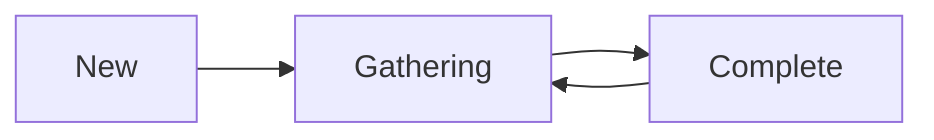

## Overview

The `GatheringState` enum describes the current state of the ICE candidate gathering process. It tracks whether the agent is discovering local network addresses and querying STUN/TURN servers.

## Type Definition

```go
type GatheringState int
```

## States

### GatheringStateNew

```go
const GatheringStateNew GatheringState = iota + 1
```

Candidate gathering has not yet started. The agent has been created but `GatherCandidates()` has not been called.

### GatheringStateGathering

```go
const GatheringStateGathering
```

The agent is actively gathering candidates. This includes:
- Discovering local network interfaces
- Creating host candidates
- Querying STUN servers for server reflexive candidates
- Allocating TURN relays for relay candidates

### GatheringStateComplete

```go
const GatheringStateComplete
```

Candidate gathering has completed. All local addresses have been discovered and all STUN/TURN queries have finished or timed out.

### GatheringStateUnknown

```go
const GatheringStateUnknown GatheringState = 0
```

Represents an unknown or uninitialized gathering state.

## Methods

### String

```go
func (t GatheringState) String() string
```

Returns the string representation of the gathering state.

**Returns:**
- `"new"` for GatheringStateNew
- `"gathering"` for GatheringStateGathering
- `"complete"` for GatheringStateComplete
- Error string for unknown states

## State Transitions



**Transitions:**

1. **New → Gathering**: When `GatherCandidates()` is called
2. **Gathering → Complete**: When all gathering operations finish
3. **Complete → Gathering**: When using continual gathering and new interfaces appear

## Usage Example

<CodeGroup>
```go Basic Gathering
agent, _ := ice.NewAgentWithOptions(
    ice.WithUrls([]*stun.URI{stunURL}),
)

// Monitor gathering with OnCandidate
agent.OnCandidate(func(c ice.Candidate) {
    if c == nil {
        log.Println("Gathering complete")
        return
    }
    log.Printf("New candidate: %s", c.String())
})

// Start gathering
if err := agent.GatherCandidates(); err != nil {
    panic(err)
}

// Check state programmatically
state, _ := agent.GetGatheringState()
log.Printf("Current gathering state: %s", state.String())
```

```go Wait for Completion
import "time"

func waitForGathering(agent *ice.Agent) error {
    ticker := time.NewTicker(100 * time.Millisecond)
    defer ticker.Stop()
    
    timeout := time.After(10 * time.Second)
    
    for {
        select {
        case <-ticker.C:
            state, err := agent.GetGatheringState()
            if err != nil {
                return err
            }
            if state == ice.GatheringStateComplete {
                return nil
            }
        case <-timeout:
            return fmt.Errorf("gathering timeout")
        }
    }
}
```
</CodeGroup>

## Continual Gathering

When continual gathering is enabled, the state can transition back from Complete to Gathering when new network interfaces are detected:

```go
agent, _ := ice.NewAgentWithOptions(
    ice.WithContinualGatheringPolicy(ice.GatherContinually),
    ice.WithNetworkMonitorInterval(2 * time.Second),
)

// With continual gathering:
// New → Gathering → Complete → Gathering → Complete → ...
```

## Gathering Timeout

You can configure how long to wait for STUN server responses:

```go
agent, _ := ice.NewAgentWithOptions(
    ice.WithUrls([]*stun.URI{stunURL}),
    ice.WithSTUNGatherTimeout(5 * time.Second), // Default: 5s
)
```

## Gathering Complete Signal

The agent signals gathering completion by calling the `OnCandidate` handler with a `nil` candidate:

```go
agent.OnCandidate(func(c ice.Candidate) {
    if c == nil {
        // Gathering is complete
        log.Println("All candidates gathered")
        
        // Safe to send candidates to remote peer
        candidates, _ := agent.GetLocalCandidates()
        sendToRemote(candidates)
    } else {
        // New candidate discovered
        log.Printf("Candidate: %s", c.String())
    }
})
```

## Continual Gathering Policy

```go
type ContinualGatheringPolicy int

const (
    GatherOnce        ContinualGatheringPolicy = iota
    GatherContinually
)
```

### GatherOnce (Default)

Gathering completes after the initial phase and stops monitoring for new interfaces.

### GatherContinually

The agent continuously monitors network interfaces and gathers new candidates when changes are detected.

```go
agent, _ := ice.NewAgentWithOptions(
    ice.WithContinualGatheringPolicy(ice.GatherContinually),
)
```

## Related

- [Agent](/api/agent) - ICE Agent with gathering methods
- [ConnectionState](/api/connection-state) - Connection state enum
- [Candidate Types](/api/candidate-types) - Types of ICE candidates
