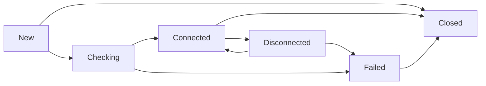

An ICE Agent is the core component that manages the ICE protocol execution, including candidate gathering, connectivity checks, and connection maintenance.

## What is an ICE Agent?

The `Agent` type (defined in `agent.go:40`) orchestrates the entire ICE process:

```go
type Agent struct {
    loop             *taskloop.Loop
    constructed      bool
    
    connectionState  ConnectionState
    gatheringState   GatheringState
    isControlling    atomic.Bool
    
    localCandidates  map[NetworkType][]Candidate
    remoteCandidates map[NetworkType][]Candidate
    checklist        []*CandidatePair
    selectedPair     atomic.Value
    
    localUfrag       string
    localPwd         string
    remoteUfrag      string
    remotePwd        string
    
    // Configuration
    disconnectedTimeout time.Duration
    failedTimeout      time.Duration
    keepaliveInterval  time.Duration
    checkInterval      time.Duration
}
```

## Creating an Agent

### Using Options (Recommended)

```go
import "github.com/pion/ice/v4"

agent, err := ice.NewAgentWithOptions(
    ice.WithNetworkTypes([]ice.NetworkType{
        ice.NetworkTypeUDP4,
        ice.NetworkTypeUDP6,
    }),
    ice.WithCandidateTypes([]ice.CandidateType{
        ice.CandidateTypeHost,
        ice.CandidateTypeServerReflexive,
        ice.CandidateTypeRelay,
    }),
    ice.WithUrls([]*stun.URI{
        {Scheme: stun.SchemeTypeSTUN, Host: "stun.l.google.com", Port: 19302},
    }),
)
if err != nil {
    panic(err)
}
defer agent.Close()
```

### Using Config (Deprecated)

```go
config := &ice.AgentConfig{
    Urls: []*stun.URI{
        {Scheme: stun.SchemeTypeSTUN, Host: "stun.l.google.com", Port: 19302},
    },
    NetworkTypes: []ice.NetworkType{
        ice.NetworkTypeUDP4,
    },
}

agent, err := ice.NewAgent(config)
```

<Note>
  The `AgentConfig` approach is deprecated. Use `NewAgentWithOptions()` for new code.
</Note>

## Agent Lifecycle

The ICE agent progresses through several phases during its lifetime:

### 1. Creation and Initialization

```go
// Create agent
agent, err := ice.NewAgentWithOptions()

// Register event handlers
agent.OnCandidate(func(c ice.Candidate) {
    if c != nil {
        // New candidate gathered
    } else {
        // Gathering complete
    }
})

agent.OnConnectionStateChange(func(state ice.ConnectionState) {
    fmt.Printf("State: %s\n", state)
})

agent.OnSelectedCandidatePairChange(func(local, remote ice.Candidate) {
    fmt.Printf("Selected pair: %s <-> %s\n", local, remote)
})
```

### 2. Credential Exchange

```go
// Get local credentials to send to peer
ufrag, pwd, err := agent.GetLocalUserCredentials()
if err != nil {
    panic(err)
}

// Send ufrag and pwd to remote peer via signaling
sendToRemotePeer(ufrag, pwd)

// Receive remote credentials from peer
remoteUfrag, remotePwd := receiveFromRemotePeer()
```

### 3. Candidate Gathering

```go
// Start gathering candidates
err = agent.GatherCandidates()
if err != nil {
    panic(err)
}

// Candidates will be delivered via OnCandidate callback
// Send each candidate to remote peer via signaling
```

<Info>
  The gathering state transitions from `GatheringStateNew` → `GatheringStateGathering` → `GatheringStateComplete`.
</Info>

### 4. Connectivity Establishment

```go
// Set remote credentials
err = agent.SetRemoteCredentials(remoteUfrag, remotePwd)
if err != nil {
    panic(err)
}

// Add remote candidates
for _, candidate := range remoteCandidates {
    err = agent.AddRemoteCandidate(candidate)
    if err != nil {
        panic(err)
    }
}

// Connect as controlling agent
conn, err := agent.Dial(context.Background(), remoteUfrag, remotePwd)
if err != nil {
    panic(err)
}

// Or accept as controlled agent
// conn, err := agent.Accept(context.Background(), remoteUfrag, remotePwd)
```

### 5. Connection Usage

```go
// Use the connection like any net.Conn
data := []byte("Hello, peer!")
n, err := conn.Write(data)

buffer := make([]byte, 1500)
n, err = conn.Read(buffer)
```

### 6. Cleanup

```go
// Close gracefully (waits for goroutines)
err = agent.GracefulClose()

// Or close immediately
// err = agent.Close()
```

## Connection States

The agent's connection state (defined in `ice.go:10-34`) tracks the ICE negotiation progress:

| State | Description |
|-------|-------------|
| `ConnectionStateNew` | Agent is gathering addresses |
| `ConnectionStateChecking` | Performing connectivity checks |
| `ConnectionStateConnected` | Successfully connected with a working pair |
| `ConnectionStateCompleted` | All checks finished (unused in v4) |
| `ConnectionStateFailed` | Unable to establish connection |
| `ConnectionStateDisconnected` | Previously connected, now experiencing issues |
| `ConnectionStateClosed` | Agent has been closed |



### State Transitions

State changes are triggered by:

- **New → Checking**: When `Dial()` or `Accept()` is called
- **Checking → Connected**: When a candidate pair succeeds
- **Connected → Disconnected**: After `disconnectedTimeout` without traffic
- **Disconnected → Failed**: After `failedTimeout` from disconnected state
- **Connected → Connected**: Can switch selected pairs during renomination
- **Any → Closed**: When `Close()` is called

Implementation in `agent.go:731-747`:

```go
func (a *Agent) updateConnectionState(newState ConnectionState) {
    if a.connectionState != newState {
        if newState == ConnectionStateFailed {
            // Clean up on failure
            a.removeUfragFromMux()
            a.checklist = make([]*CandidatePair, 0)
            a.setSelectedPair(nil)
            a.deleteAllCandidates()
        }
        
        a.connectionState = newState
        a.connectionStateNotifier.EnqueueConnectionState(newState)
    }
}
```

## Controlling vs Controlled Roles

ICE agents take on one of two roles during connection establishment:

### Controlling Agent

- **Initiates nomination** of candidate pairs
- Sends binding requests with `USE-CANDIDATE` attribute
- Typically the peer that initiated the session (caller)
- Set by calling `Dial()`

```go
// Becomes controlling agent
conn, err := agent.Dial(ctx, remoteUfrag, remotePwd)
```

### Controlled Agent

- **Responds to nomination** from controlling agent
- Accepts nominated pairs
- Typically the peer that received the session (callee)
- Set by calling `Accept()`

```go
// Becomes controlled agent
conn, err := agent.Accept(ctx, remoteUfrag, remotePwd)
```

### Role Conflicts

If both agents claim the same role, ICE resolves the conflict using the tie-breaker value (randomly generated 64-bit number). The agent with the higher tie-breaker value keeps its role; the other switches.

Implementation in `agent.go:1452-1481`:

```go
func (a *Agent) handleRoleConflict(msg *stun.Message, local, remote Candidate, remoteTieBreaker *AttrControl) {
    localIsGreaterOrEqual := a.tieBreaker >= remoteTieBreaker.Tiebreaker
    
    if (a.isControlling.Load() && localIsGreaterOrEqual) || 
       (!a.isControlling.Load() && !localIsGreaterOrEqual) {
        // Send role conflict error
    } else {
        // Switch our role
        a.isControlling.Store(!a.isControlling.Load())
        a.setSelector()
    }
}
```

## Agent Configuration Options

Pion ICE provides extensive configuration through options:

### Network Configuration

```go
agent, err := ice.NewAgentWithOptions(
    // Specify network types
    ice.WithNetworkTypes([]ice.NetworkType{
        ice.NetworkTypeUDP4,
        ice.NetworkTypeUDP6,
        ice.NetworkTypeTCP4,
    }),
    
    // Port range for local candidates
    ice.WithPortRange(10000, 20000),
    
    // Interface filtering
    ice.WithInterfaceFilter(func(iface string) bool {
        return iface != "docker0" // Skip Docker interfaces
    }),
)
```

### Candidate Configuration

```go
agent, err := ice.NewAgentWithOptions(
    // Candidate types to gather
    ice.WithCandidateTypes([]ice.CandidateType{
        ice.CandidateTypeHost,
        ice.CandidateTypeServerReflexive,
        ice.CandidateTypeRelay,
    }),
    
    // STUN/TURN servers
    ice.WithUrls([]*stun.URI{
        {Scheme: stun.SchemeTypeSTUN, Host: "stun.l.google.com", Port: 19302},
        {Scheme: stun.SchemeTypeTURN, Host: "turn.example.com", Port: 3478,
         Username: "user", Password: "pass"},
    }),
)
```

### Timeout Configuration

Configured in `agent_config.go:16-59`:

```go
disconnectedTimeout := 5 * time.Second
failedTimeout := 25 * time.Second
keepaliveInterval := 2 * time.Second

agent, err := ice.NewAgentWithOptions(
    ice.WithDisconnectedTimeout(disconnectedTimeout),
    ice.WithFailedTimeout(failedTimeout),
    ice.WithKeepaliveInterval(keepaliveInterval),
)
```

<Accordion title="Understanding timeout values">
**Disconnected Timeout** (default 5s):
- How long without traffic before transitioning to `ConnectionStateDisconnected`
- Set to 0 to never go to disconnected

**Failed Timeout** (default 25s):
- How long in disconnected state before transitioning to `ConnectionStateFailed`
- Set to 0 to never go to failed

**Keepalive Interval** (default 2s):
- How often to send STUN binding requests to maintain the connection
- Set to 0 to disable keepalives (not recommended)

**Check Interval** (default 200ms):
- How often to perform connectivity checks while in checking state
</Accordion>

### Advanced Configuration

```go
agent, err := ice.NewAgentWithOptions(
    // ICE Lite mode (servers with public IPs)
    ice.WithLite(true),
    
    // Custom logging
    ice.WithLoggerFactory(customLoggerFactory),
    
    // NAT 1:1 IP mapping
    ice.WithAddressRewriteRules([]ice.AddressRewriteRule{
        {
            External:        []string{"203.0.113.1"},
            AsCandidateType: ice.CandidateTypeHost,
        },
    }),
    
    // Maximum binding requests before failing
    ice.WithMaxBindingRequests(7),
    
    // Multicast DNS
    ice.WithMulticastDNSMode(ice.MulticastDNSModeQueryAndGather),
)
```

## Restarting an Agent

You can restart an agent to perform ICE restart (generates new credentials):

```go
// Restart with new credentials
err = agent.Restart("", "") // Empty strings auto-generate new credentials

// Or provide specific credentials
err = agent.Restart(newUfrag, newPwd)

// After restart, gather candidates again
err = agent.GatherCandidates()
```

From `agent.go:1694-1754`, restarting:
- Cancels ongoing gathering
- Clears all candidates
- Resets checklist and selected pair
- Generates new credentials if not provided
- Returns to `ConnectionStateChecking` (if not new)

## Event Handlers

### OnCandidate

```go
agent.OnCandidate(func(c ice.Candidate) {
    if c == nil {
        fmt.Println("Gathering complete")
    } else {
        fmt.Printf("New candidate: %s\n", c)
        // Send to remote peer via signaling
    }
})
```

### OnConnectionStateChange

```go
agent.OnConnectionStateChange(func(state ice.ConnectionState) {
    switch state {
    case ice.ConnectionStateConnected:
        fmt.Println("Connected!")
    case ice.ConnectionStateFailed:
        fmt.Println("Connection failed")
    case ice.ConnectionStateDisconnected:
        fmt.Println("Connection lost")
    }
})
```

### OnSelectedCandidatePairChange

```go
agent.OnSelectedCandidatePairChange(func(local, remote ice.Candidate) {
    fmt.Printf("Selected pair changed to: %s <-> %s\n", 
        local.String(), remote.String())
})
```

## Best Practices

<Note>
  **Always set event handlers before calling `GatherCandidates()`** to ensure you don't miss any candidates.
</Note>

<Tip>
  Use `GracefulClose()` instead of `Close()` when shutting down to ensure all goroutines complete cleanly.
</Tip>

<Accordion title="When to use ICE Lite">
ICE Lite is suitable when:
- Your application runs on a server with a public IP address
- You want to reduce server complexity
- The remote peer will be a full ICE agent
- You don't need relay candidates

Lite agents only gather host candidates and don't perform active connectivity checks.
</Accordion>

## Related Topics

- [ICE Protocol](/concepts/ice-protocol) - Overview of the ICE protocol
- [Candidates](/concepts/candidates) - Understanding candidate types
- [Connectivity](/concepts/connectivity) - Connection establishment details