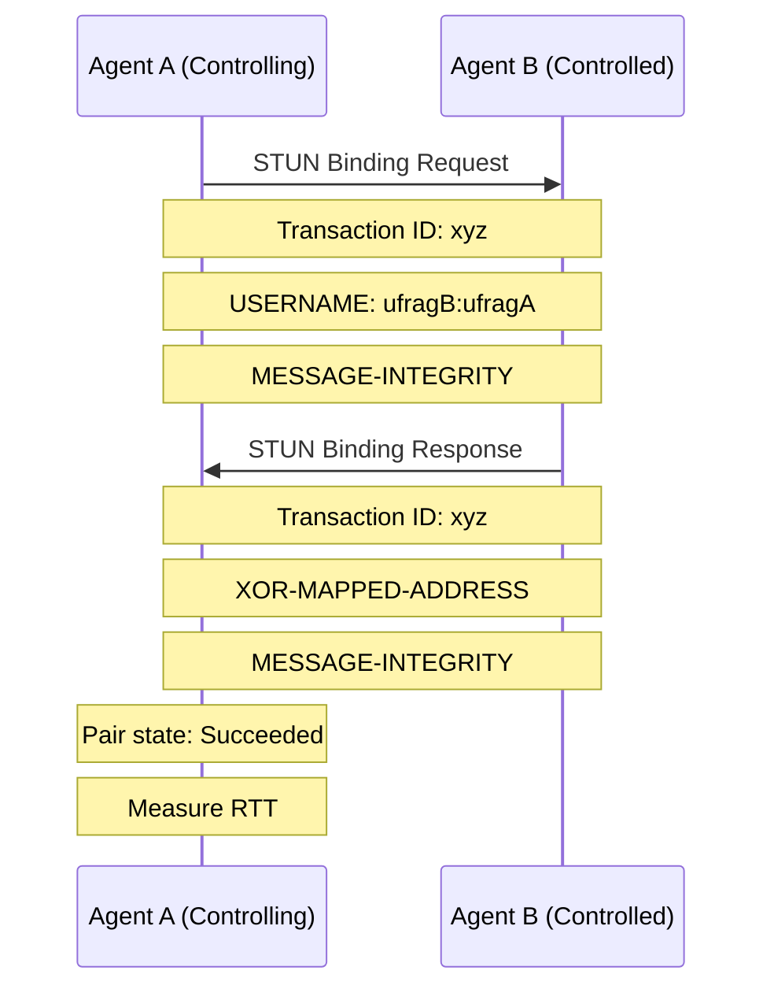
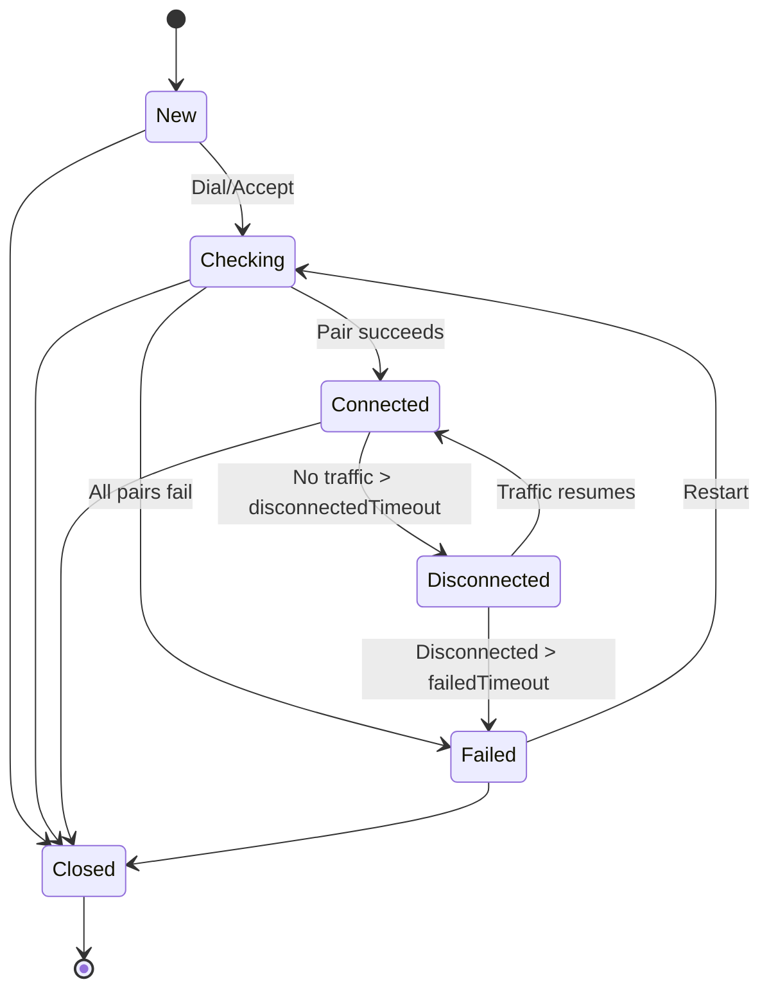
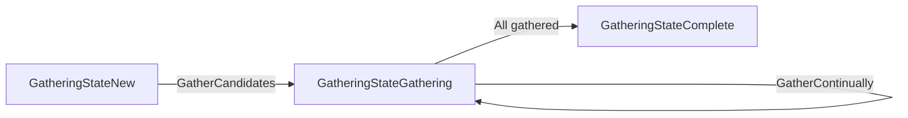

ICE connectivity is the process of establishing and maintaining a peer-to-peer connection by testing candidate pairs and selecting the optimal path.

## Connection Establishment

The connection establishment process follows these steps:

### 1. Exchange Credentials

```go
// Local agent
ufrag, pwd, _ := agent.GetLocalUserCredentials()
sendToRemote(ufrag, pwd)

// Receive from remote
remoteUfrag, remotePwd := receiveFromRemote()
agent.SetRemoteCredentials(remoteUfrag, remotePwd)
```

Credentials consist of:
- **ufrag** (username fragment): At least 24 bits of randomness
- **pwd** (password): At least 128 bits of randomness

These are used for STUN message authentication.

### 2. Exchange Candidates

```go
// Gather local candidates
agent.OnCandidate(func(c ice.Candidate) {
    if c != nil {
        sendToRemote(c.Marshal())
    }
})
agent.GatherCandidates()

// Add remote candidates
for _, remoteCandidateStr := range remoteCandidates {
    candidate, _ := ice.UnmarshalCandidate(remoteCandidateStr)
    agent.AddRemoteCandidate(candidate)
}
```

### 3. Start Connectivity Checks

```go
// As controlling agent (initiator)
conn, err := agent.Dial(context.Background(), remoteUfrag, remotePwd)

// Or as controlled agent (receiver)
conn, err := agent.Accept(context.Background(), remoteUfrag, remotePwd)
```

From `agent.go:625-652`, starting checks:

```go
func (a *Agent) startConnectivityChecks(isControlling bool, remoteUfrag, remotePwd string) error {
    // Set remote credentials
    a.SetRemoteCredentials(remoteUfrag, remotePwd)
    
    // Set role
    a.isControlling.Store(isControlling)
    a.setSelector()  // Choose controllingSelector or controlledSelector
    
    // Transition state
    a.updateConnectionState(ConnectionStateChecking)
    
    // Start connectivity check loop
    a.requestConnectivityCheck()
    go a.connectivityChecks()
}
```

## Connectivity Checks

### The Check Process

Connectivity checks test whether candidate pairs can successfully communicate.

<Info>
  Connectivity checks use STUN Binding Requests and Responses to verify that a path works and measure round-trip time.
</Info>

#### Check Flow



#### Implementation

From `agent.go:654-729`, the connectivity check loop:

```go
func (a *Agent) connectivityChecks() {
    lastConnectionState := ConnectionState(0)
    checkingDuration := time.Time{}
    
    for {
        interval := defaultKeepaliveInterval
        
        switch lastConnectionState {
        case ConnectionStateNew, ConnectionStateChecking:
            // Check frequently while connecting
            interval = a.checkInterval  // default 200ms
            
        case ConnectionStateConnected, ConnectionStateDisconnected:
            // Less frequent keepalives
            interval = a.keepaliveInterval  // default 2s
        }
        
        // Wait for interval or forced check
        select {
        case <-time.After(interval):
            a.getSelector().ContactCandidates()
        case <-a.forceCandidateContact:
            a.getSelector().ContactCandidates()
        case <-a.loop.Done():
            return
        }
    }
}
```

### Candidate Pair States

From `candidatepair_state.go:9-26`:

| State | Description |
|-------|-------------|
| `CandidatePairStateWaiting` | Check has not been performed |
| `CandidatePairStateInProgress` | Check sent, waiting for response |
| `CandidatePairStateFailed` | Check failed or timed out |
| `CandidatePairStateSucceeded` | Check succeeded |

Transitions:
```
Waiting → InProgress → Succeeded
                    ↓
                  Failed
```

### Ping Candidates

From `agent.go:772-794`, pinging all pairs in checklist:

```go
func (a *Agent) pingAllCandidates() {
    for _, p := range a.checklist {
        if p.state == CandidatePairStateWaiting {
            p.state = CandidatePairStateInProgress
        } else if p.state != CandidatePairStateInProgress {
            continue
        }
        
        if p.bindingRequestCount > a.maxBindingRequests {
            // Too many retries, mark as failed
            p.state = CandidatePairStateFailed
        } else {
            // Send binding request
            a.getSelector().PingCandidate(p.Local, p.Remote)
            p.bindingRequestCount++
        }
    }
}
```

### Selecting the Best Pair

From `agent.go:843-858`, finding the highest priority succeeded pair:

```go
func (a *Agent) getBestValidCandidatePair() *CandidatePair {
    var best *CandidatePair
    for _, p := range a.checklist {
        if p.state != CandidatePairStateSucceeded {
            continue
        }
        
        if best == nil || best.priority() < p.priority() {
            best = p
        }
    }
    return best
}
```

## Connection State Transitions

From `ice.go:10-34`, the connection states:

```go
const (
    ConnectionStateNew           // Gathering addresses
    ConnectionStateChecking      // Performing connectivity checks
    ConnectionStateConnected     // Pair selected and connected
    ConnectionStateCompleted     // All checks finished (unused)
    ConnectionStateFailed        // Unable to connect
    ConnectionStateDisconnected  // Was connected, now having issues
    ConnectionStateClosed        // Agent closed
)
```

### State Diagram



### Checking → Connected

Transition occurs when a candidate pair succeeds:

```go
// In selector's HandleSuccessResponse
if bestPair := a.getBestValidCandidatePair(); bestPair != nil {
    // If controlling and should nominate
    if a.isControlling.Load() && !bestPair.nominated {
        // Send nomination
        a.sendNominationRequest(bestPair)
    }
    
    // If pair is nominated (by us or remote)
    if bestPair.nominated {
        a.setSelectedPair(bestPair)
        // Triggers transition to Connected
    }
}
```

### Connected → Disconnected

From `agent.go:882-922`, validation checks:

```go
func (a *Agent) validateSelectedPair() bool {
    selectedPair := a.getSelectedPair()
    if selectedPair == nil {
        return false
    }
    
    disconnectedTime := time.Since(selectedPair.Remote.LastReceived())
    
    totalTimeToFailure := a.failedTimeout
    if totalTimeToFailure != 0 {
        totalTimeToFailure += a.disconnectedTimeout
    }
    
    state := a.connectionStateForDisconnection(disconnectedTime, totalTimeToFailure)
    a.updateConnectionState(state)
    
    return true
}

func (a *Agent) connectionStateForDisconnection(
    disconnectedTime time.Duration,
    totalTimeToFailure time.Duration,
) ConnectionState {
    disconnected := a.disconnectedTimeout != 0 && 
                    disconnectedTime > a.disconnectedTimeout
    failed := totalTimeToFailure != 0 && 
              disconnectedTime > totalTimeToFailure
    
    switch {
    case failed:
        return ConnectionStateFailed
    case disconnected:
        return ConnectionStateDisconnected
    default:
        return ConnectionStateConnected
    }
}
```

**Example timeline:**
- t=0s: Connected
- t=5s: No traffic received → Disconnected (if disconnectedTimeout=5s)
- t=30s: Still no traffic → Failed (if failedTimeout=25s)

<Note>
  Set `disconnectedTimeout` to 0 to skip the disconnected state and go directly to failed.
</Note>

## Gathering States

From `ice.go:58-72`:

```go
const (
    GatheringStateNew         // Gathering not started
    GatheringStateGathering   // Actively gathering
    GatheringStateComplete    // All candidates gathered
)
```

### Gathering Flow



From `gather.go:79-113`:

```go
func (a *Agent) gatherCandidates(ctx context.Context, done chan struct{}) {
    defer close(done)
    
    a.setGatheringState(GatheringStateGathering)
    a.gatherCandidatesInternal(ctx)
    
    switch a.continualGatheringPolicy {
    case GatherOnce:
        a.setGatheringState(GatheringStateComplete)
        
    case GatherContinually:
        // Continue monitoring for network changes
        go a.startNetworkMonitoring(ctx)
    }
}
```

## Keep-alive Mechanism

Once connected, the agent must maintain the connection through keepalives.

### Purpose of Keep-alive

1. **Maintain NAT bindings**: NATs have timeouts (typically 30-300 seconds)
2. **Detect disconnections**: Verify the path is still working
3. **Consent freshness**: RFC 7675 requires ongoing consent

### Implementation

From `agent.go:924-938`:

```go
func (a *Agent) checkKeepalive() {
    selectedPair := a.getSelectedPair()
    if selectedPair == nil {
        return
    }
    
    if a.keepaliveInterval != 0 {
        // Send binding request (not indication) for consent freshness
        // See https://tools.ietf.org/html/rfc7675
        a.getSelector().PingCandidate(selectedPair.Local, selectedPair.Remote)
    }
}
```

<Info>
  Pion ICE uses STUN Binding Requests for keepalives (not Binding Indications) to support consent freshness requirements from RFC 7675.
</Info>

### Keepalive Timing

```go
agent, err := ice.NewAgentWithOptions(
    // Send keepalives every 2 seconds (default)
    ice.WithKeepaliveInterval(2 * time.Second),
    
    // Disable keepalives (not recommended)
    // ice.WithKeepaliveInterval(0),
)
```

**Recommendations:**
- **Minimum**: 15 seconds (to avoid excessive traffic)
- **Default**: 2 seconds (works well for most scenarios)
- **Maximum**: 15-20 seconds (risk NAT timeout)

## Handling Disconnections

### Detecting Disconnection

Disconnection is detected when no traffic is received:

```go
selectedPair := agent.GetSelectedCandidatePair()
timeSinceLastPacket := time.Since(selectedPair.Remote.LastReceived())

if timeSinceLastPacket > disconnectedTimeout {
    // Connection is disconnected
}
```

### Recovery Strategies

#### 1. Wait for Recovery

The agent continues sending keepalives during disconnection:

```go
agent.OnConnectionStateChange(func(state ice.ConnectionState) {
    switch state {
    case ice.ConnectionStateDisconnected:
        // Connection lost, but keepalives continue
        log.Println("Connection lost, attempting recovery...")
        
    case ice.ConnectionStateConnected:
        // Recovered!
        log.Println("Connection recovered")
    }
})
```

#### 2. ICE Restart

Perform a full ICE restart with new credentials:

```go
agent.OnConnectionStateChange(func(state ice.ConnectionState) {
    if state == ice.ConnectionStateDisconnected {
        go func() {
            time.Sleep(5 * time.Second)
            if agent.ConnectionState() == ice.ConnectionStateDisconnected {
                // Still disconnected, restart ICE
                agent.Restart("", "")  // Generate new credentials
                agent.GatherCandidates()
                // Exchange new candidates and credentials with peer
            }
        }()
    }
})
```

#### 3. Renomination (Advanced)

Switch to a different candidate pair without restarting:

```go
agent.OnConnectionStateChange(func(state ice.ConnectionState) {
    if state == ice.ConnectionStateDisconnected {
        // Trigger renomination of different pair
        // (requires enabling renomination support)
    }
})
```

## Connection Failures

### Failure Scenarios

1. **All candidate pairs fail**
   - No working path between peers
   - Might need relay candidates

2. **Timeout in checking state**
   - Exceeded `disconnectedTimeout + failedTimeout` while checking
   - From `agent.go:670-680`

3. **Prolonged disconnection**
   - Connected then lost connection for `disconnectedTimeout + failedTimeout`

### Handling Failure

```go
agent.OnConnectionStateChange(func(state ice.ConnectionState) {
    switch state {
    case ice.ConnectionStateFailed:
        log.Println("ICE failed, trying restart...")
        
        // Option 1: ICE restart
        agent.Restart("", "")
        agent.GatherCandidates()
        
        // Option 2: Give up and close
        // agent.Close()
    }
})
```

## Monitoring Connection Health

### Using Callbacks

```go
agent.OnConnectionStateChange(func(state ice.ConnectionState) {
    metrics.RecordConnectionState(state.String())
})

agent.OnSelectedCandidatePairChange(func(local, remote ice.Candidate) {
    log.Printf("Selected pair: %s <-> %s", local.Type(), remote.Type())
    metrics.RecordCandidateTypes(local.Type().String(), remote.Type().String())
})
```

### Checking Selected Pair

```go
pair, err := agent.GetSelectedCandidatePair()
if err != nil || pair == nil {
    log.Println("No selected pair")
    return
}

log.Printf("Local: %s:%d (%s)", 
    pair.Local.Address(), pair.Local.Port(), pair.Local.Type())
log.Printf("Remote: %s:%d (%s)", 
    pair.Remote.Address(), pair.Remote.Port(), pair.Remote.Type())
```

### Pair Statistics

From `candidatepair.go:131-336`, available metrics:

```go
pair, _ := agent.GetSelectedCandidatePair()

// Round trip time
rtt := pair.CurrentRoundTripTime()  // in seconds
totalRtt := pair.TotalRoundTripTime()

// Connectivity check stats
requestsSent := pair.RequestsSent()
responsesReceived := pair.ResponsesReceived()

// Application traffic stats
packetsSent := pair.PacketsSent()
bytesReceived := pair.BytesReceived()

// Timestamps
lastSent := pair.LastPacketSentAt()
lastReceived := pair.LastPacketReceivedAt()
```

## Best Practices

<Tip>
  **Configure timeouts based on your use case:**
  - Real-time gaming: Short timeouts (3s disconnected, 10s failed)
  - Video conferencing: Medium timeouts (5s disconnected, 25s failed)
  - File transfer: Long timeouts (30s disconnected, 60s failed)
</Tip>

<Note>
  **Always handle state changes** in your application. Don't assume the connection will stay in the connected state.
</Note>

<Accordion title="Debugging connectivity issues">
**Common issues and solutions:**

1. **Stuck in checking state**
   - Check if remote candidates were added
   - Verify credentials match
   - Ensure STUN/TURN servers are reachable
   - Check firewall rules

2. **Connected then immediate disconnect**
   - Verify keepalive is enabled
   - Check if NAT timeout is very short
   - Ensure application sends data

3. **Only works with relay**
   - Symmetric NAT on both sides
   - Firewall blocking UDP
   - Check if srflx candidates are gathered

4. **Frequent disconnections**
   - Network instability
   - NAT rebinding
   - Enable continual gathering
   - Consider increasing timeouts
</Accordion>

<Accordion title="Optimizing for mobile networks">
Mobile networks present unique challenges:

```go
agent, err := ice.NewAgentWithOptions(
    // Enable continual gathering to handle network switches
    ice.WithContinualGatheringPolicy(ice.GatherContinually),
    
    // Shorter timeouts for faster recovery
    ice.WithDisconnectedTimeout(3 * time.Second),
    ice.WithFailedTimeout(10 * time.Second),
    
    // More aggressive keepalives
    ice.WithKeepaliveInterval(1 * time.Second),
)
```

Handle network type changes:
```go
agent.OnConnectionStateChange(func(state ice.ConnectionState) {
    if state == ice.ConnectionStateDisconnected {
        // Mobile network might have switched (WiFi ↔ Cellular)
        // Continual gathering will find new candidates automatically
    }
})
```
</Accordion>

## Related Topics

- [ICE Protocol](/concepts/ice-protocol) - Overview of the ICE protocol
- [Agents](/concepts/agents) - Understanding ICE agent lifecycle
- [Candidates](/concepts/candidates) - Types of candidates and gathering